<p align="center">
  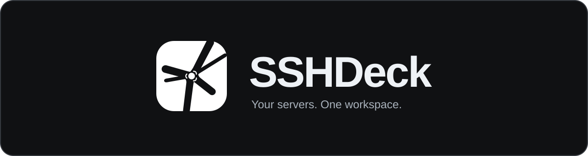
</p>

<p align="center"><strong>A self-hosted SSH workspace for your browser.</strong><br>
Terminals, remote files and reusable commands — on desktop, tablet and phone.</p>

<p align="center">
  <a href="#quick-start">Get started</a> ·
  <a href="#your-workspace">Explore</a> ·
  <a href="#files-two-ways">Files</a> ·
  <a href="#documentation">Documentation</a> ·
  <a href="#contributing">Contributing</a>
</p>

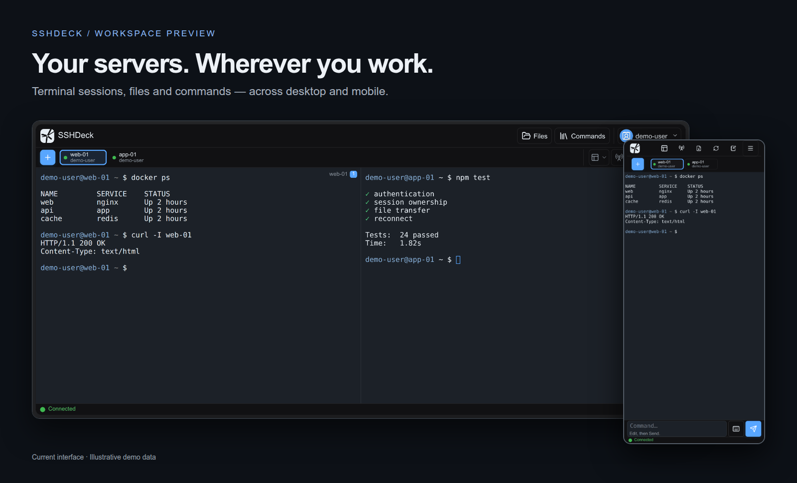

SSHDeck brings your servers into one place: open SSH sessions, arrange terminals side by side, browse files without leaving a connection, and reuse the commands you run every day. Host it on your own infrastructure and sign in from a browser. Each account has its own profiles, keys, commands, notes and preferences.

## Quick start

From the SSHDeck source directory, build the image and start a local instance:

```bash
docker build -t sshdeck:local .
docker run -d --name sshdeck \
  -p 127.0.0.1:5000:5000 \
  -e CORS_ORIGINS=http://localhost:5000 \
  -e SESSION_COOKIE_SECURE=false \
  -e TMUX_ENABLED=true -e TMUX_DEFAULT=true \
  -v sshdeck_data:/app/data \
  --restart unless-stopped \
  sshdeck:local
```

Open [localhost:5000](http://localhost:5000), create the first account, then choose **New Connection**. The first registered account becomes administrator. The image is built locally; these instructions do not require a published registry image.

Docker generates `SECRET_KEY` on first start and keeps it in the data volume with your account data. Preserve this volume across updates. For access from other devices, configure HTTPS and an explicit public origin using the [deployment guide](docs/getting-started.md). [Docker Compose](docker-compose.yml) and [source installation](docs/getting-started.md#run-from-source) are also supported.

## Your workspace

### Keep several servers in view

Use session tabs for navigation and split panes for work that belongs together: application logs beside a shell, or several machines during maintenance. Layouts support up to **6 panes on desktop, 4 on tablet and 2 on phone**. Search terminal output, save a transcript, and switch between browser selection and application mouse input.

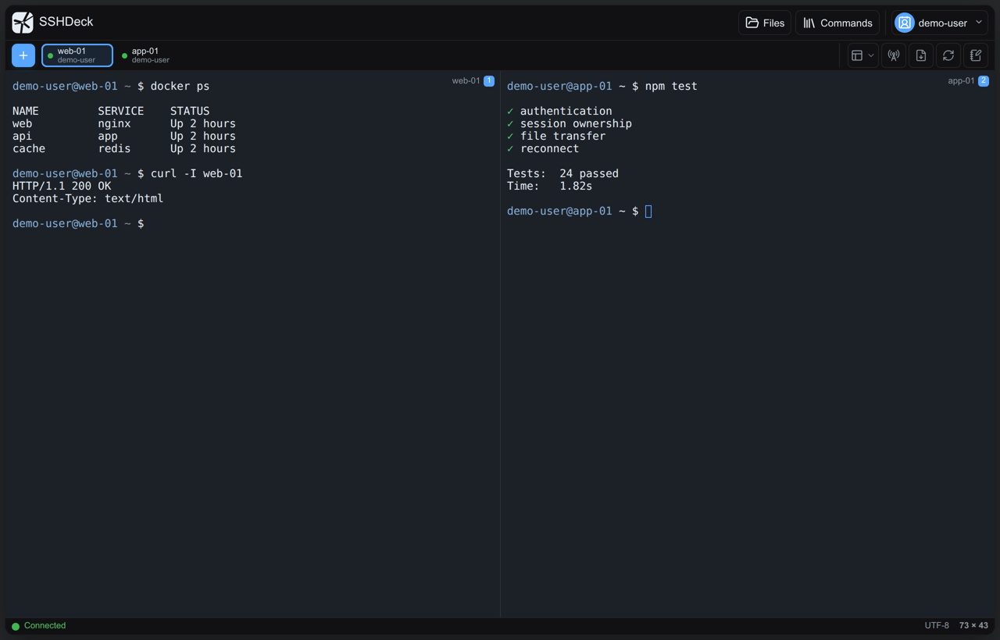

**Broadcast** uses a shared command composer. Choose all connected sessions or a specific subset, review the targets, then send. Disconnected sessions are excluded.

<details>
<summary>Watch the workspace tour</summary>

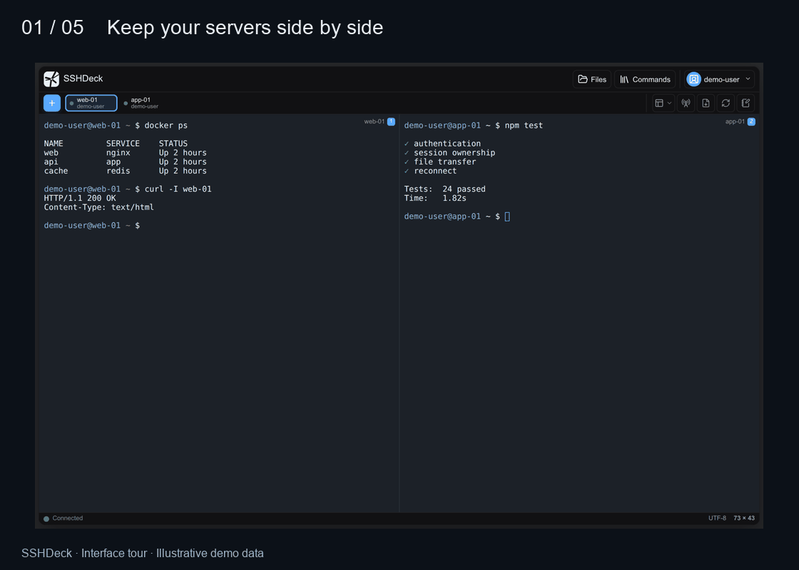

</details>

### Pick up a remote session again

Enable persistent sessions to run your shell inside **tmux on the remote host**. Closing the browser, an SSH idle timeout or an SSHDeck restart leaves that tmux session available to reattach. If tmux is unavailable, SSHDeck falls back to a regular shell.

Multiple devices can view the same tmux session. Its terminal size follows the smallest attached view; hidden browser tabs detach their view. Regular shells share one PTY instead. Explicit **Disconnect** attempts to end the remote tmux session; logout and account revocation also clean up live connections. See [session behavior](docs/workflows.md#persistent-sessions) before relying on persistence.

### A terminal that fits your phone

The touch workspace includes a command composer and a special-key keypad. In normal touch input, typing streams to the terminal; pasted text and IME composition are held for editing before Send. Switch between sessions, scroll history, open notes or browse the active connection's files.

<p align="center">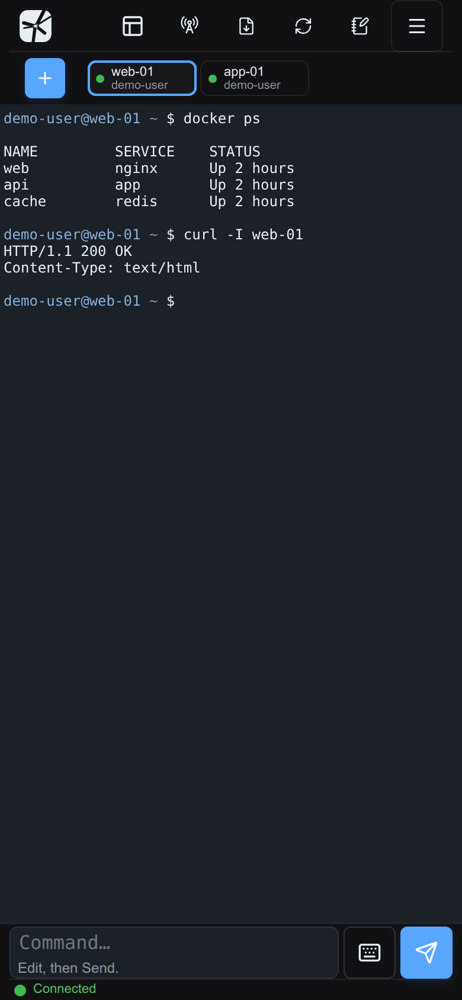</p>

## Files, two ways

### Files beside the active connection

Open **Files** to browse the active SSH connection in the workspace's auxiliary panel, alongside the area used by Notes and Commands. It appears as a side panel on desktop and a bottom sheet on phones. Browse directories, upload and download files, or open a text file for preview and editing through SFTP.

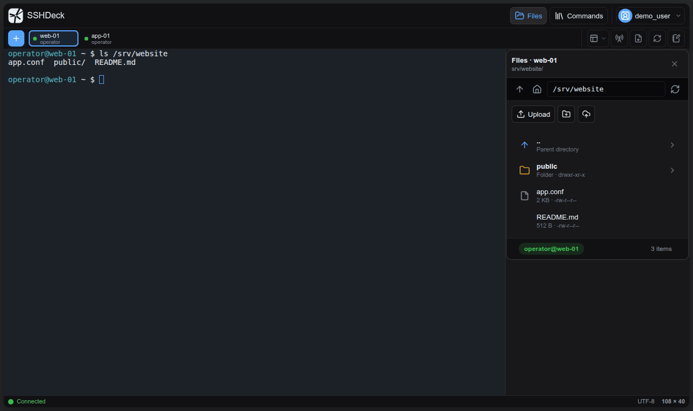

<details>
<summary>See Files on a phone</summary>

<p align="center">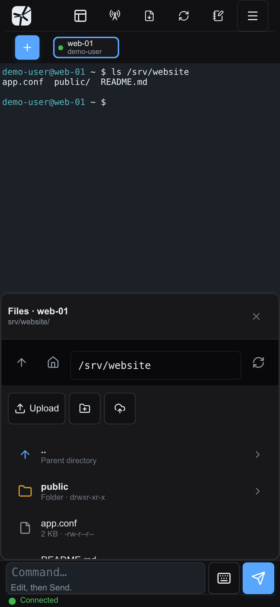</p>

</details>

### File Transfer between locations

Open **File Transfer** from the account menu for the separate two-pane workspace. Choose a source and destination from existing SSH sessions or new file-transfer connections. Transfer files or directories between remote hosts, with progress and cancellation. The SSHDeck server relays these transfers.

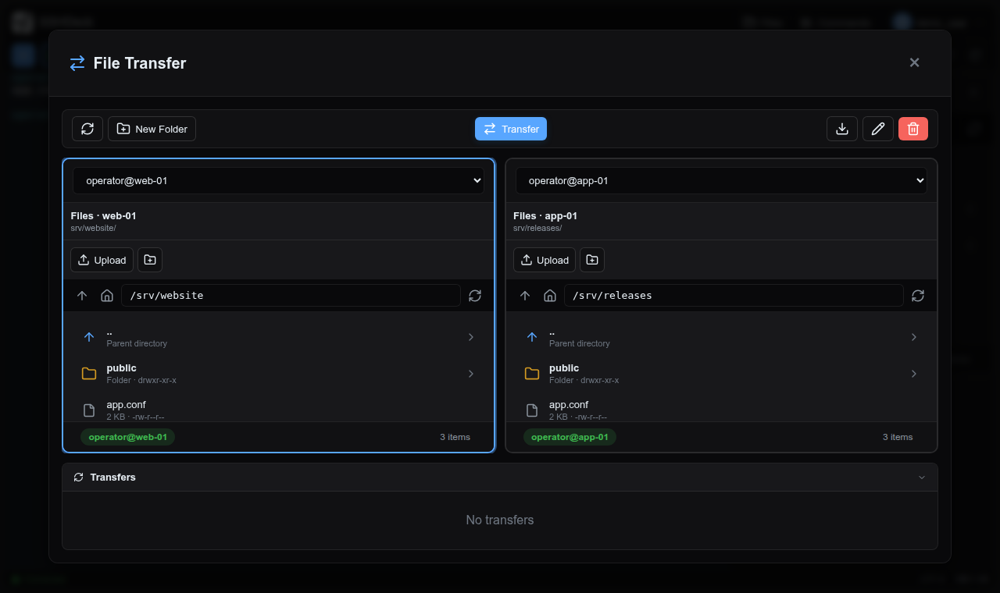

Local-folder access depends on the browser's File System Access API. Remote listing and server-to-server transfers use SSH exec and require `python3`; directory transfers also require `tar` on both ends. Preview and text editing still use SFTP. See [file capabilities and requirements](docs/workflows.md#files-and-transfers).

<details>
<summary>Preview and edit a text file</summary>

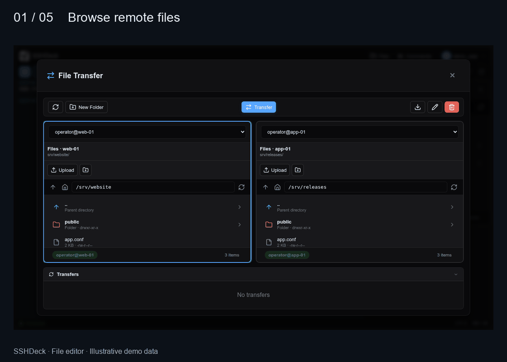

</details>

## Connect once, reuse what works

Save connection profiles with host, user, authentication choice, optional jump host and post-connect action. Manage profiles independently of an open connection, or launch one from an empty pane. Password-dependent connections ask for a password; profiles do not store SSH passwords.

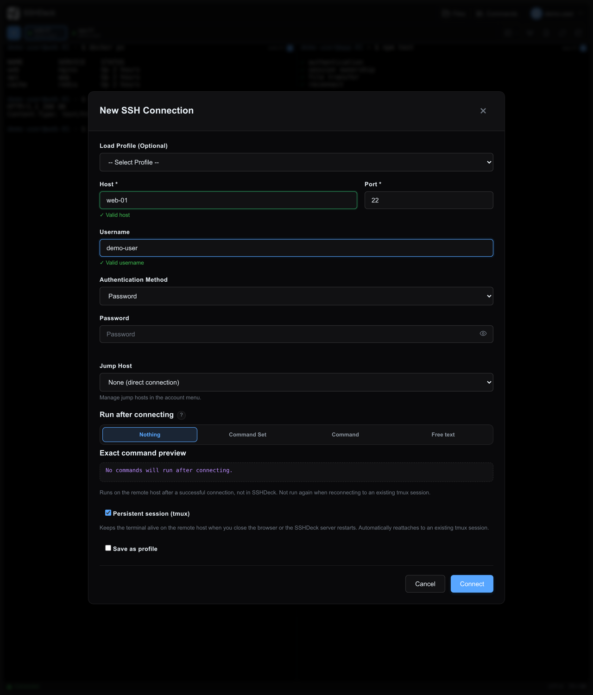

Import **RSA, Ed25519 or ECDSA** private keys, stored encrypted at rest. Passphrase-encrypted imported keys and DSA keys are not supported. Optional [Tailscale SSH](docs/tailscale-ssh.md) uses the SSHDeck node's shared identity and is restricted to administrators and explicitly allowed users.

<details>
<summary>SSH keys and advanced connection options</summary>

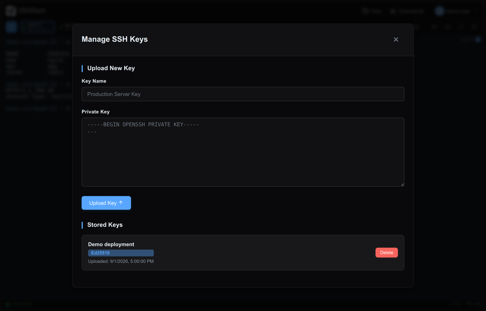

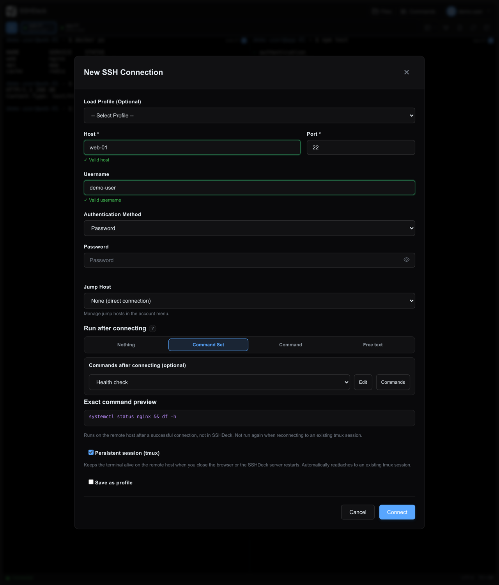

</details>

### Commands for repeatable work

The **Command Library** keeps reusable commands close to the terminal, with search and operating-system filters. **Command Sets** combine library entries and free-text steps into an ordered sequence. Assign a set, a single command or free text to run after a new connection, with an exact preview before connecting.

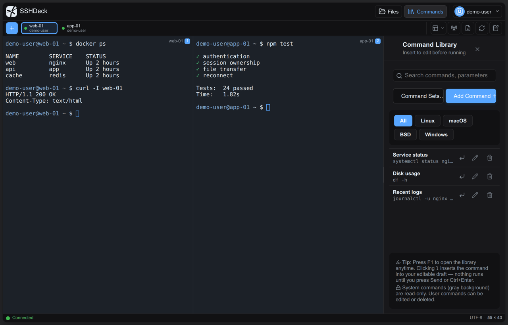

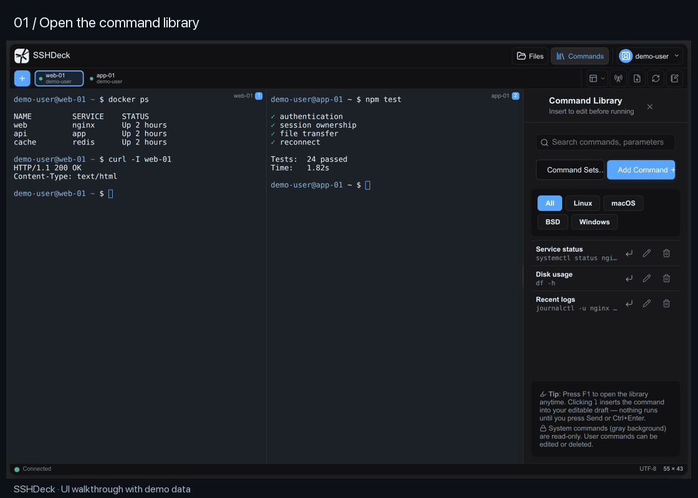

<details>
<summary>Command Sets: execution, sudo, references and legacy profiles</summary>


The connection dialog offers four explicit choices under **Run after
connecting**: nothing, one reusable **Command Set**, one saved **Command**, or
one-off **Free text**. Only the active mode is sent to the server. An exact
preview shows what will run before the connection is started. A selected
Command can use its saved parameters, an override, or an intentionally empty
override without modifying the library entry.

Open **Commands** for the command-library rail, then **Command Sets…** for the separate set-management dialog. The library supports search and operating-system filters; the set builder lets you select library commands and add free-text steps.

A command set is an ordered list of steps. A step can reference a command from
the command library or contain free text. Library steps use the command's
current parameters by default; disable **Use library parameters** to provide an
override or intentionally leave the override empty. Free-text steps can stay in
the set or be moved into the command library with **Save as library command**.
Steps can be reordered by drag and drop or by the accessible up/down buttons.


**Run commands with sudo** is opt-in for new command sets. When enabled, SSHDeck
prefixes each non-empty resolved command line unless it already starts with
`sudo`; blank and comment-only lines remain unchanged. Existing command sets
from an earlier version and sets produced by legacy conversion keep their saved
sudo setting, so upgrading or converting does not change what runs.

SSHDeck does not store or answer a sudo password. If the remote account requires
one, its normal prompt appears in the terminal. The added prefixes count toward
the existing maximum 4096 characters for the resolved command text.

Profiles are managed independently from connecting under the account menu.
They can be created, inspected, updated, or deleted without opening an SSH
session. A profile stores the selected post-connect mode and only its relevant
reference or free text; credentials are never stored. Editing a referenced set
or library command therefore updates every profile that uses its saved
definition. A set cannot be deleted while a profile references it, and a
user-created library command cannot be deleted while a set or profile
references it. The UI reports the profiles or sets that must be changed first.

After a new SSH connection succeeds, SSHDeck resolves the latest referenced
commands on the server, validates the combined text (maximum 4096 characters),
and sends the steps to the remote interactive shell in their saved order.
Resolved command-set steps are joined with `&&` only between steps, so the next
block starts only when the preceding block succeeds. SSHDeck does not rewrite a
step: line breaks inside a free-text step remain unchanged, including its
authored shell control flow, and the final command's exit status determines
whether the next step starts. The commands run on the remote SSH host, never
inside the SSHDeck container. Reattaching to an existing persistent tmux session does not run them again.

Existing profiles that still contain the former free-text startup commands keep
working after an update. They show a legacy notice in the connection dialog and
can be converted into a named set. Conversion creates the set first, then links
the profile; the old text remains stored as a fallback but is ignored while the
new set reference is valid. The profile's legacy startup commands retain their
original multiline behavior until they are converted.

Command output and errors appear normally in the terminal. The remote shell
evaluates the `&&` chain; SSHDeck does not interpret exit statuses itself. Treat
command sets like any other remote administration automation: review their
contents and grant SSHDeck accounts only the SSH privileges they actually need.

No additional environment variable, Compose setting, frontend build step, or
external service is required. Command sets are stored per user in the existing
`DATA_DIR` volume alongside profiles and the command library.

</details>

### Keep context with your work

**Notes** can be global to your account or associated with a server. Use them for maintenance reminders, paths and troubleshooting context while keeping the terminal visible.

## Make it yours

Choose from **10 themes** and **6 interface languages**: English, Vietnamese, German, Spanish, French and Chinese. Themes cover the workspace and supporting screens; Paper Ops provides the light option.

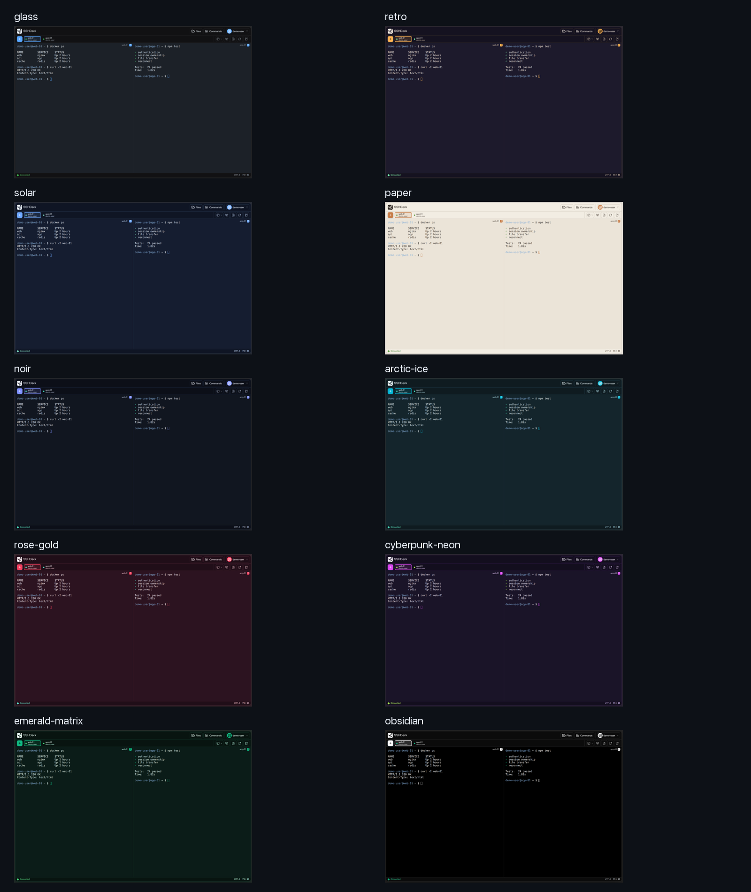

Administrators can manage accounts, lock access, review audit events, disable registration and change runtime limits. Default capacity guards are **100 SSH sessions globally, 50 per user and 8 views per session**; they are configurable rather than pane-layout limits.

## Hosting and trust

SSHDeck is the SSH client. Your browser connects to SSHDeck, and SSHDeck connects to your servers. Terminal content and file transfers pass through this host; trust and protect it accordingly.

- Use HTTPS, an explicit allowed origin and correctly configured proxy trust for remote access.
- Keep the application **single-worker**: live SSH connections are held in process memory. Optional Redis rate limiting does not change this requirement.
- Back up the data directory and keep `SECRET_KEY` stable. Access to both the secret and encrypted key files allows decryption.
- New SSH host keys are accepted on first use and persisted; changed known keys are rejected.
- SSHDeck uses local accounts. It does not currently provide MFA or LDAP/SSO.

Read [hosting and data protection](docs/hosting.md) for credential handling, retained data, account deletion and SSH compatibility. Report vulnerabilities privately as described in [SECURITY.md](SECURITY.md).

<a id="subfolder-deployment"></a>

For deployment under `/sshdeck`, see [Subfolder Deployment](docs/configuration.md#subfolder-deployment).

## Documentation

| Guide | Contents |
| --- | --- |
| [Getting started](docs/getting-started.md) | Docker, Compose, source installation and first connection |
| [Workflows](docs/workflows.md) | Sessions, terminal interaction and both file surfaces |
| [Configuration](docs/configuration.md) | Environment variables, runtime overrides and reverse proxies |
| [Hosting and data protection](docs/hosting.md) | Trust boundaries, backups and SSH compatibility |
| [Tailscale SSH](docs/tailscale-ssh.md) | Shared identity, authorization and deployment |
| [Contributing](CONTRIBUTING.md) | Development setup, tests and the contribution workflow |
| [Commercial licensing](COMMERCIAL.md) | When a commercial licence is needed, and how to get one |
| [Changelog](CHANGELOG.md) | Release history |

Screenshots show the current interface with demonstration accounts and data. Animated tours are illustrated sequences of those UI states, not recordings of live server operations. See [media notes](docs/media.md).

## Contributing

Pull requests are welcome, and the bar is public. Everything in steps 3 to 6 is
checked by CI on every pull request, so you can see a green tick before a human
looks at it.

**1. Open an issue first** for anything beyond a typo or an obvious bug fix. A
short conversation about the approach costs less than a rewritten branch. Small,
focused pull requests get merged; one that changes several unrelated things gets
questions instead.

**2. Fork, branch from `main`, and make the change.**

**3. Make both suites green.** A red run is not reviewed:

```bash
pytest tests/ --ignore=tests/integration --ignore=tests/browser -q   # 1180 tests
npm ci && npx playwright install chromium webkit
node scripts/run_gates.mjs                                           # 99 gates
```

If a gate goes red, `run_gates.mjs` re-runs it on its own before reporting, and
prints `XANH KHI CHẠY RIÊNG` ("green when run alone") when it then passes — that
is a known flaky gate, not your regression.

**4. New behaviour needs a test that fails without it.** For the backend that is
a pytest file; for anything a user can see, a gate in `tests/browser/`. Copy the
shape of an existing gate — they render the real templates and stub the socket,
so they need no server and no account. This is the most common reason a pull
request waits.

**5. If you changed a file under `static/` or `templates/`, raise its `?v=` pin.**
A cached asset is invisible to everyone except the person who changed it;
`tests/test_modal_shell_contract.py` asserts the pins.

**6. Sign off your commits** with `git commit -s`. That adds the
`Signed-off-by:` line of the
[Developer Certificate of Origin](https://developercertificate.org/), stating
you wrote the change or have the right to submit it.

**7. Open the pull request** and fill in the template: what changed, why, and
what you ran. Paste the numbers — "tests pass" is not a measurement.

Anything touching credentials, sessions or encryption gets a second pass rather
than a faster merge. Say so in the description even when you are confident.

**Before you start**, one thing worth knowing: SSHDeck is licensed, not public
domain. By contributing you agree your work is licensed under the same
[PolyForm Noncommercial License](LICENSE), and that the maintainer may also
license it commercially — without that, a single contributed line would make the
commercial licence impossible to offer. [CONTRIBUTING.md](CONTRIBUTING.md) has
the full wording, the local setup, the project layout and the code style.

## Acknowledgments

SSHDeck is an independent project that began from [WebSSH](https://github.com/bifrost0x/webssh) by H31mdall. Thank you to the original project for its work on browser-based SSH access. Its MIT copyright and permission notice is kept in [UPSTREAM-MIT-LICENSE.txt](UPSTREAM-MIT-LICENSE.txt) and reproduced in [NOTICE.md](NOTICE.md), and the original project remains available under MIT from its own repository.

Built with [xterm.js](https://xtermjs.org/), [Paramiko](https://www.paramiko.org/), [Flask-SocketIO](https://flask-socketio.readthedocs.io/) and [SQLAlchemy](https://www.sqlalchemy.org/). Frontend libraries are served locally from `static/vendor/`.

Licensed under the [PolyForm Noncommercial License 1.0.0](LICENSE): free for personal, hobby, study, research, nonprofit, educational and government use; commercial use needs a separate licence — see [COMMERCIAL.md](COMMERCIAL.md). Third-party components keep their own terms, which SSHDeck's licence does not restrict; they are listed in [NOTICE.md](NOTICE.md).
